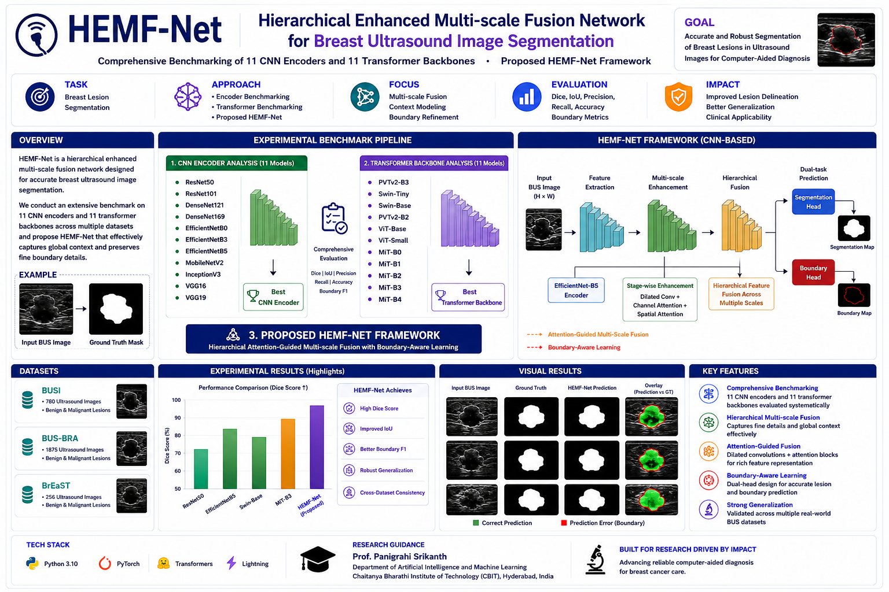
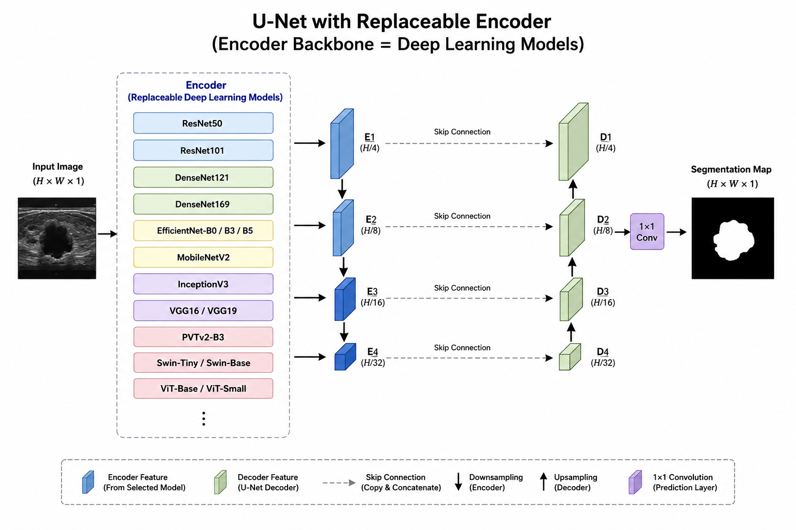
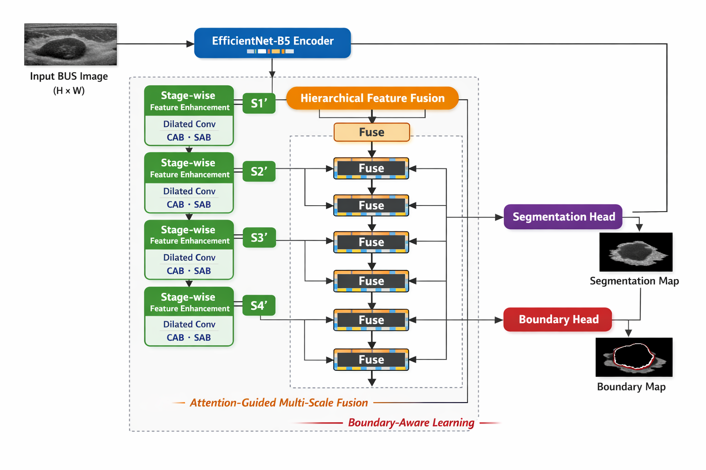
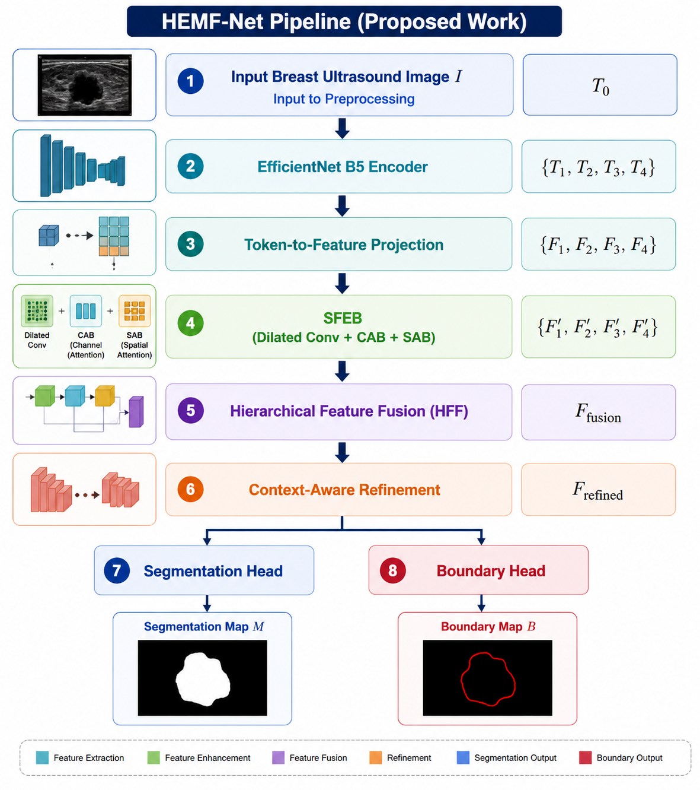

# ultrasound-BUSI-image-segmentation

HEMF-Net is a hierarchical multi-scale fusion framework for breast ultrasound image segmentation that systematically evaluates 11 CNN encoders and 11 transformer backbones while introducing a boundary-aware segmentation architecture for accurate lesion delineation across multiple BUS datasets.

# HEMF-Net

> **Guided by Prof. Panigrahi Srikanth**  
> Department of Artificial Intelligence and Machine Learning (AI & ML)

A hierarchical enhanced multi-scale fusion framework for breast ultrasound image segmentation that combines stage-wise feature enhancement, hierarchical feature fusion, attention-guided learning, and boundary-aware prediction for accurate lesion segmentation.

<p align="center">
  
</p>

<h1 align="center">HEMF-Net</h1>

<h3 align="center">
Hierarchical Enhanced Multi-scale Fusion Network for Breast Ultrasound Image Segmentation
</h3>

<p align="center">
  
  
  
  
</p>

---

## Overview

HEMF-Net is a breast ultrasound image segmentation framework designed to accurately delineate lesion boundaries through hierarchical multi-scale feature learning and boundary-aware segmentation.

The framework integrates:

- CNN Encoder Benchmarking
- Transformer Backbone Benchmarking
- Stage-wise Feature Enhancement
- Dilated Convolution Modules
- Channel Attention Blocks (CAB)
- Spatial Attention Blocks (SAB)
- Hierarchical Multi-scale Fusion
- Boundary-Aware Learning
- Dual-Task Prediction

The architecture captures both local lesion structures and global contextual information while preserving fine-grained lesion boundaries.

---

## Dataset Information

The framework is evaluated on multiple benchmark breast ultrasound image segmentation datasets:

- BUSI
- BUS-BRA
- BrEaST

Due to dataset licensing restrictions and repository size limitations, datasets are not included in this repository.

---

## U-Net with replaceable CNN Encoders 

<p align="center">
  
</p>
---

## Transformer Backbone Benchmark

The framework evaluates eleven transformer backbones:

- PVTv2-B3
- Swin-Tiny
- Swin-Base
- PVTv2-B2
- ViT-Base
- ViT-Small
- MiT-B0
- MiT-B1
- MiT-B2
- MiT-B3
- MiT-B4

---

## Proposed Architecture

<p align="center">
  
</p>

---

## Workflow Pipeline

<p align="center">
  
</p>

---

## Experimental Results

| Dataset | IoU ↑ | Dice ↑ | Accuracy ↑ |
|----------|----------|----------|----------|
| BUSI | **0.67** | **0.81** | **96.15%** |
| BUS-BRA | **0.83** | **0.90** | **98.00%** |
| BrEaST | **0.67** | **0.80** | **98.00%** |

---

## Project Structure

```bash
HEMF-Net/
│
├── assets/
│   ├── interface.png
│   ├── architecture.png
│   ├── workflow.png
│   ├── results.png
│
├── datasets/
│
├── checkpoints/
├── notebooks/
├── src/
│
├── train.py
├── test.py
├── requirements.txt
├── setup.py
├── .gitignore
├── LICENSE
└── README.md
```

---

## Technologies Used

- Python
- PyTorch
- NumPy
- Pandas
- OpenCV
- Matplotlib
- Scikit-Learn
- Medical Image Segmentation
- Deep Learning
- Transformer Networks
- Computer Vision

---

## Key Features

- Evaluation of 11 CNN Encoders
- Evaluation of 11 Transformer Backbones
- Stage-wise Feature Enhancement
- Dilated Convolution Integration
- Channel Attention Blocks (CAB)
- Spatial Attention Blocks (SAB)
- Hierarchical Multi-scale Fusion
- Boundary-Aware Learning
- Dual-Task Segmentation Framework
- Cross-Dataset Evaluation

---

## Why HEMF-Net?

Breast ultrasound image segmentation remains a challenging task due to speckle noise, low contrast, irregular lesion morphology, and ambiguous boundaries.

HEMF-Net addresses these challenges through hierarchical multi-scale feature fusion, attention-guided feature enhancement, and boundary-aware learning. The framework progressively refines feature representations across multiple scales and leverages dedicated segmentation and boundary prediction heads to improve lesion delineation.

In addition to the proposed framework, extensive benchmarking of eleven CNN encoders and eleven transformer backbones provides a comprehensive analysis of feature extraction strategies for breast ultrasound segmentation.

---
